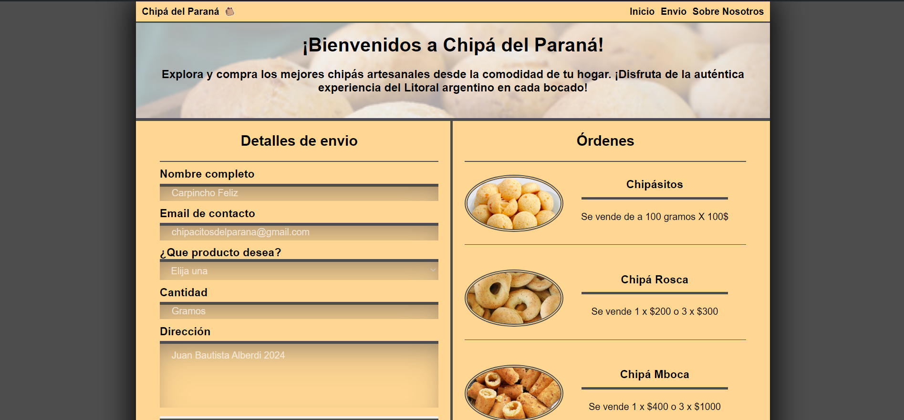

<h1 align='center'>🌟 Proyecto final N°4 del curso Responsive Web Design de FreeCodeCamp 🌟</h1>

> Este proyecto es 4/5 para la certificación del curso. :sparkles:

## Landing page sobre chipá 🍴🧀
🎯 Objetivo: Construir una aplicación que sea funcionalmente similar a https://product-landing-page.freecodecamp.rocks. No copies este proyecto de demostración.

### Historias de usuario (Descripción) 📋
1. Tu página de inicio de producto debe tener un elemento <code>header</code> con un correspondiente <code>id="header"</code>.
2. Puedes ver una imagen dentro del elemento <code>header</code> con un correspondiente <code>id="header-img"</code> (Un logotipo sería una buena imagen aquí).
3. Dentro el elemento <code>#header</code>, puedes ver un elemento <code>nav</code> con su correspondiente <code>id="nav-bar"</code>.
4. Puedes ver al menos tres elementos cliqueables dentro del elemento <code>nav</code>, cada uno con la clase <code>nav-link</code>.
5. Cuando hagas click en un botón <code>.nav-link</code> en el elemento <code>nav</code>, serás redirigido a la sección correspondiente de la página de inicio.
6. Puedes ver un vídeo del producto incrustado con <code>id="video"</code>.
7. Tu página de inicio tiene un elemento <code>form</code> con un correspondiente <code>id="form"</code>.
8. Dentro del formulario, hay un campo input con <code>id="email"</code>, donde puedes ingresar tu dirección de email.
9. El campo de entrada <code>#email</code> debe tener un marcador de texto para que los usuarios sepan para qué sirve este campo.
10. El campo de entrada <code>#email</code> usa validación HTML5 para confirmar que el texto ingresado es una dirección de email.
11. Dentro del formulario, hay un input de tipo submit (enviar) con su correspondiente <code>id="submit"</code>.
12. Cuando haces click en el elemento <code>#submit</code>, el email es enviado a una página web (Utiliza esta URL de pruebas: https://www.freecodecamp.com/email-submit).
13. La barra de navegación siempre debe estar en la parte superior de la vista.
14. La página de inicio de tu producto debe tener al menos una consulta de medios.
15. Tu página de inicio del producto debe utilizar el flexbox CSS al menos una vez.

### Pruebas (Pruebas Técnicas a pasar) ✔️🔬 
- 🧪 Debes tener un elemento <code>header</code> con un <code>id</code> de <code>header</code>.
- 🧪 Debes tener un elemento <code>img</code> con un <code>id</code> de <code>header-img</code>.
- 🧪 Tu <code>#header-img</code> debe ser descendiente de <code>#header</code>.
- 🧪 Tu <code>#header-img</code> debe tener un atributo <code>src</code>.
- 🧪 El valor del <code>src</code> de <code>#header-img</code> debe ser una URL válida (inicia con <code>http</code>).
- 🧪 Debes tener un elemento <code>nav</code> con un <code>id</code> de <code>nav-bar</code>.
- 🧪 Tu <code>#nav-bar</code> debe ser descendiente de <code>#header</code>.
- 🧪 Debes tener al menos 3 elementos <code>.nav-link</code> dentro del <code>#nav-bar</code>.
- 🧪 Cada elemento <code>.nav-link</code> debe tener un atributo <code>href</code>.
- 🧪 Cada elemento <code>.nav-link</code> debe estar enlazado a su elemento correspondiente en la página de aterrizaje (el valor que tiene el <code>href</code> es el <code>id</code> de otro elemento, por ejemplo, <code>#footer</code>).
- 🧪 Debes tener un elemento <code>video</code> o <code>iframe</code> con un <code>id</code> de <code>video</code>.
- 🧪 Tu <code>#video</code> debe tener un atributo <code>src</code>.
- 🧪 Debes tener un elemento <code>form</code> con un <code>id</code> de <code>form</code>.
- 🧪 Debes tener un elemento <code>input</code> con un <code>id</code> de <code>email</code>.
- 🧪 Tu <code>#email</code> debe ser descendiente de <code>#form</code>.
- 🧪 Tu <code>#email</code> debe tener el atributo <code>placeholder</code> con un texto marcador de posición.
- 🧪 Tu <code>#email</code> debe usar la validación HTML5 estableciendo su <code>type</code> a <code>email</code>.
- 🧪 Debes tener un elemento <code>input</code> con un <code>id</code> de <code>submit</code>.
- 🧪 Tu <code>#submit</code> debe ser descendiente de <code>#form</code>.
- 🧪 Tu <code>#submit</code> debe tener un <code>type</code> de <code>submit</code>.
- 🧪 Tu <code>#form</code> debe tener un atributo <code>action</code> de <code>https://www.freecodecamp.com/email-submit</code>.
- 🧪 Tu <code>#email</code> debe tener un atributo <code>name</code> de <code>email</code>.
- 🧪 Tu <code>#nav-bar</code> siempre debe estar en la parte superior de la ventana gráfica.
- 🧪 Tu página de aterrizaje de un producto debe usar por lo menos una consulta de medios.
- 🧪 Tu página de aterrizaje de un producto debe usar CSS Flexbox por lo menos una vez.
  
------------

### Instalación 🛠️💻

Sigue estos pasos para clonar y ejecutar el proyecto localmente:

1. Clona este repositorio en tu máquina local utilizando Git:

    ```bash
    git clone https://github.com/Schugu/ProyectoFinalFreeCodeCamp4.git
    ```

2. Navega al directorio del proyecto:

    ```bash
    cd ProyectoFinalFreeCodeCamp4
    ```

3. Una vez clonado el repositorio en tu máquina local, abre el archivo `index.html` en tu navegador web para ver el proyecto.

4. Si deseas personalizar los estilos de la página, puedes hacerlo modificando el archivo `styles.css`. Este archivo contiene todas las reglas de estilo que se aplican a la página. Abre el archivo `styles.css` en un editor de texto o IDE de tu elección, realiza los cambios que desees y guarda el archivo. Luego, recarga la página en tu navegador para ver los cambios aplicados.

------------

### Capturas de pantalla 📸

